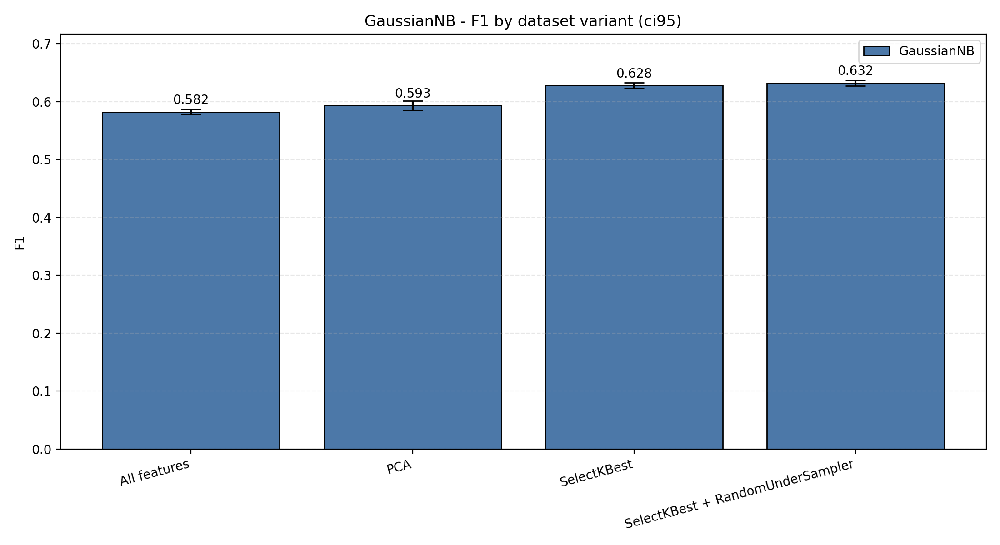
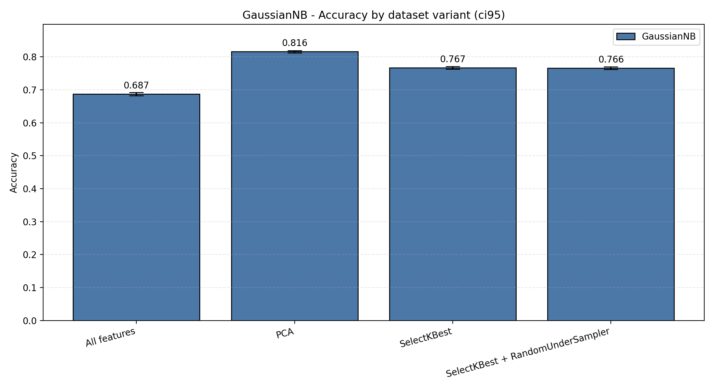
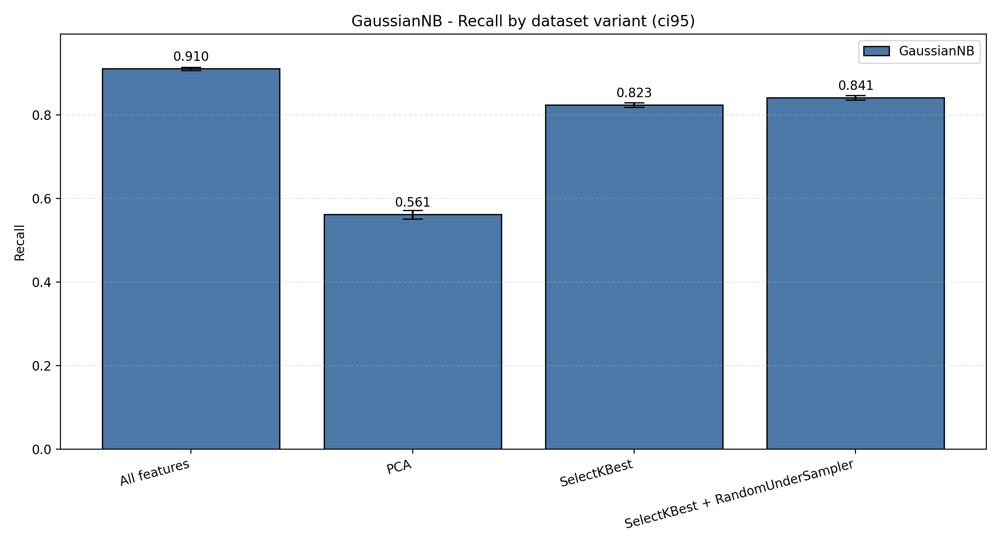
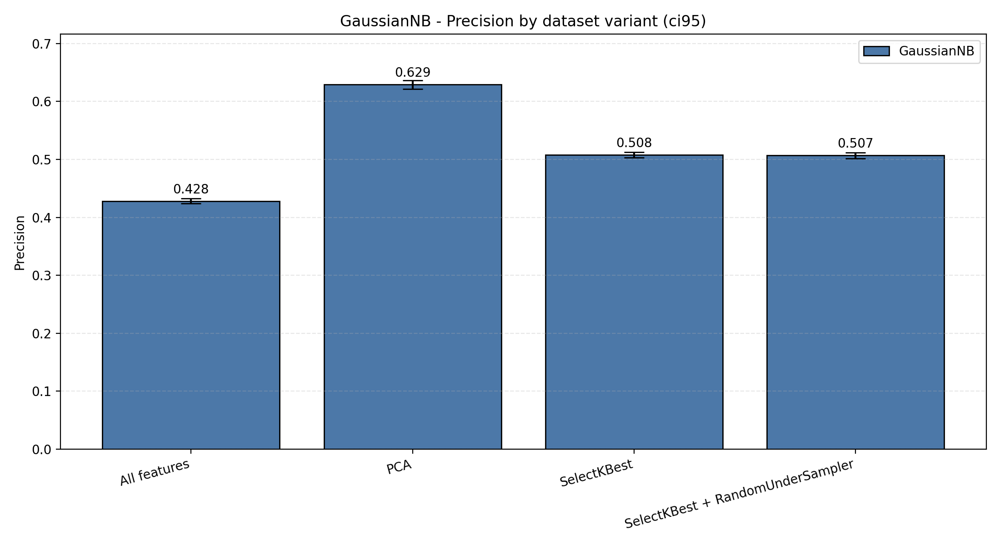

# Apresentacao - Atividade 5

---

## 1. Objetivo

- Implementar estimacao de desempenho sem vazamento de dados.
- Fazer calibracao de hiperparametros com F1-score como metrica principal.
- Reportar F1, acuracia, recall e precisao com validacao cruzada estratificada aninhada.

---

## 2. Metodo

- Classificador avaliado: `GaussianNB`.
- Variantes comparadas: `All features`, `PCA`, `SelectKBest`, `SelectKBest + RandomUnderSampler`.
- Estimacao de desempenho: nested stratified cross-validation (`k1=10`, `k2=10`).
- Ajuste fino no loop interno, estimacao final no loop externo.
- Imputacao, encoding, escalonamento, PCA, selecao de atributos e undersampling foram ajustados apenas nos folds de treino.

---

## 3. Tabela de resultados

| Variante | Melhor ajuste | F1 media (IC95) | Acuracia media (IC95) | Recall medio (IC95) | Precisao media (IC95) |
| --- | --- | --- | --- | --- | --- |
| All features | {'nb__var_smoothing': 1e-06} | 0.5822 (0.0042) | 0.6874 (0.0048) | 0.9100 (0.0034) | 0.4281 (0.0042) |
| PCA | {'nb__var_smoothing': 1e-09, 'pca__n_components': 20} | 0.5933 (0.0086) | 0.8158 (0.0033) | 0.5613 (0.0101) | 0.6292 (0.0074) |
| SelectKBest | {'nb__var_smoothing': 1e-09, 'selector__k': 20} | 0.6282 (0.0046) | 0.7666 (0.0039) | 0.8233 (0.0052) | 0.5078 (0.0050) |
| SelectKBest + RandomUnderSampler | {'nb__var_smoothing': 1e-09, 'selector__k': 20} | 0.6324 (0.0047) | 0.7659 (0.0040) | 0.8412 (0.0055) | 0.5067 (0.0051) |

Legenda da tabela: valores em parenteses = IC95 entre os folds externos.

---

## 4. Grafico de F1-score

Legenda: barras = media; erro = IC95; cor = GaussianNB nas diferentes variantes de dataset.

---

## 5. Grafico de acuracia

Legenda: barras = media; erro = IC95; cor = GaussianNB nas diferentes variantes de dataset.

---

## 6. Grafico de recall

Legenda: barras = media; erro = IC95; cor = GaussianNB nas diferentes variantes de dataset.

---

## 7. Grafico de precisao

Legenda: barras = media; erro = IC95; cor = GaussianNB nas diferentes variantes de dataset.

---

## 8. Interpretacao

- Melhor F1 medio: `SelectKBest + RandomUnderSampler` (`0.6324`).
- Melhor acuracia media: `PCA` (`0.8158`).
- Melhor recall medio: `All features` (`0.9100`).
- PCA aumentou a precisao, mas reduziu recall.
- O uso de selecao de atributos melhorou o equilibrio entre recall e precisao.

---

## 9. Limitacoes

- O custo computacional da nested CV 10x10 com multiplas variantes foi alto.
- Mesmo assim, a estrutura correta de estimacao foi preservada para evitar vazamento de dados.
- Se necessario, uma repeticao futura pode ampliar a busca de hiperparametros ou incluir outros classificadores.

